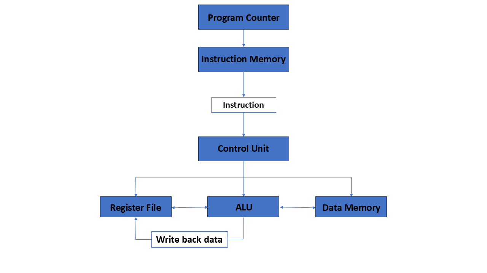
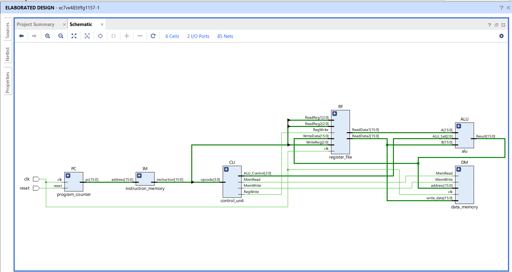
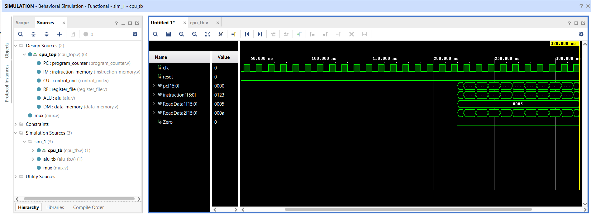

# 16-bit RISC Processor Design using Verilog HDL

## Project Overview

This project implements a simplified **16-bit RISC (Reduced Instruction Set Computer) Processor** using **Verilog HDL**. The processor was designed from scratch by integrating the essential components of a basic CPU, including the Program Counter, Instruction Memory, Control Unit, Register File, ALU, and Data Memory.

The design was simulated and verified using **Xilinx Vivado**, demonstrating successful execution of arithmetic, logical, shift, and memory operations.

---

## Features

- 16-bit processor architecture
- Modular Verilog design
- Arithmetic operations
  - Addition
  - Subtraction
- Logical operations
  - AND
  - OR
  - XOR
  - NOT
- Shift operations
  - Logical Left Shift
  - Logical Right Shift
- Register File with read/write functionality
- Instruction Memory
- Data Memory
- Program Counter
- Control Unit for instruction decoding
- Behavioral Simulation
- RTL Schematic Generation

---

## Project Structure

```
RISC-Processor-Verilog/
│
├── src/
│   ├── alu.v
│   ├── control_unit.v
│   ├── cpu_top.v
│   ├── data_memory.v
│   ├── instruction_memory.v
│   ├── mux.v
│   ├── program_counter.v
│   └── register_file.v
│
├── tb/
│   ├── alu_tb.v
│   └── cpu_tb.v
│
├── docs/
│   └── RISC Processor Verilog report.pdf
│
├── images/
│   ├── Block_diagram.PNG
│   ├── RTL_Schematic.png
│   └── simulation_waveform.png
│
├── README.md
└── LICENSE
```

---

## Processor Architecture
The processor consists of the following modules:

- Program Counter (PC)
- Instruction Memory (IM)
- Control Unit (CU)
- Register File (RF)
- Arithmetic Logic Unit (ALU)
- Data Memory (DM)

The Program Counter fetches instructions from the Instruction Memory. The Control Unit decodes the instruction and generates control signals. The Register File supplies operands to the ALU, which performs the selected operation. Data Memory handles memory read/write operations when required.

---

## Simulation Results
Behavioral simulation was performed in **Xilinx Vivado** to verify the processor functionality.

The simulation confirms:

- Correct instruction fetch
- Proper control signal generation
- Register read/write operations
- ALU arithmetic and logical operations
- Memory access functionality
- Stable processor execution

---

## RTL Design
The RTL schematic generated by Vivado confirms the structural connectivity between all processor modules and verifies the overall architecture.

---

## Images

### Block Diagram



---

### RTL Schematic



---

### Simulation Waveform



---

## Tools Used
- Verilog HDL
- Xilinx Vivado 2025.2
- Git
- GitHub
- Visual Studio Code

---

## Future Improvements
Future enhancements may include:

- Pipeline implementation
- Branch and jump instructions
- Hazard detection unit
- Forwarding unit
- Cache memory
- Interrupt handling
- Extended instruction set
- FPGA implementation

---

## Learning Outcomes
Through this project, the following concepts were explored:

- Digital Logic Design
- Computer Architecture
- Verilog HDL
- CPU Datapath Design
- Control Unit Design
- RTL Design
- Simulation and Verification
- FPGA Design Flow
- Version Control using Git and GitHub

---

## Author
**Aparna Dubey and Aayush Jhanwar**

## License
This project is licensed under the MIT License.
